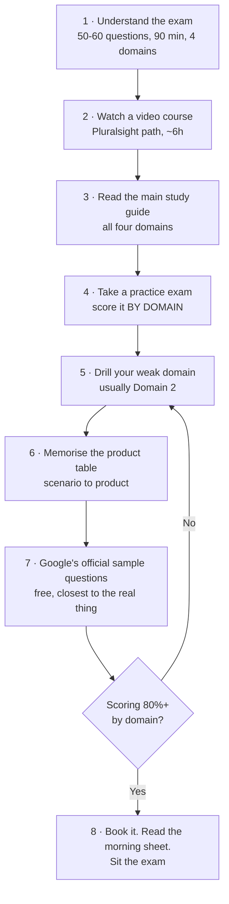
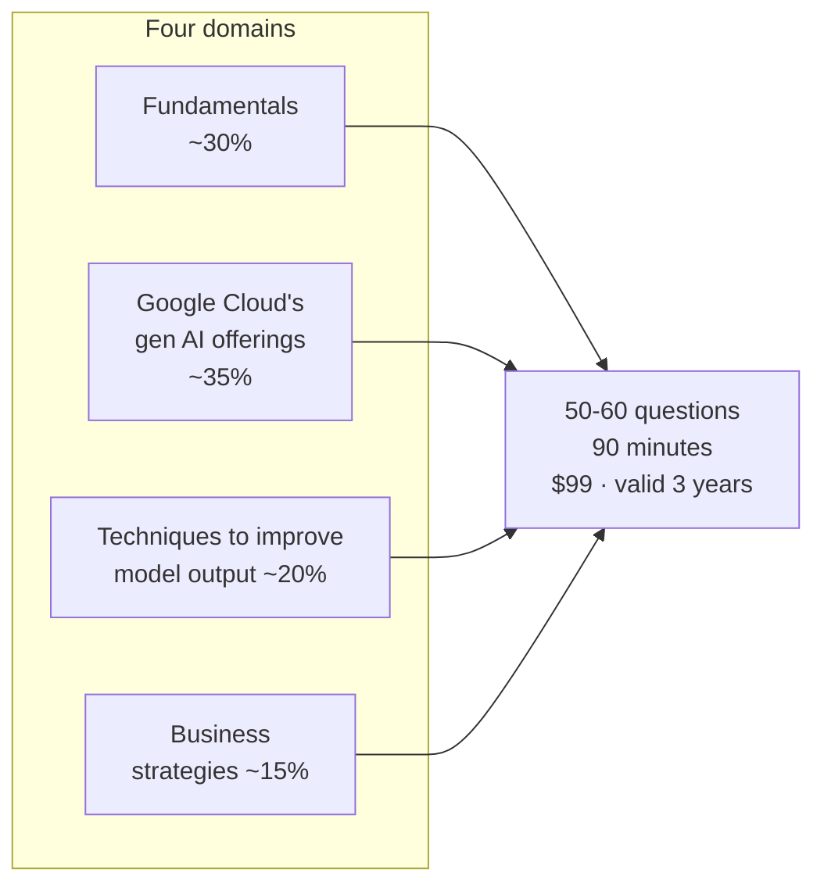

# Google Cloud Generative AI Leader — Study Guide

> Everything I used to pass the **Google Cloud Certified Generative AI Leader** exam on the first attempt, organised as a step-by-step path. Free, no sign-up, no braindumps.

**Passed:** 22 September 2026 · **Study time:** roughly 40 hours over three weeks · **Cost:** $99 for the exam.

---

## ⚠️ Read this first: Google renamed almost every product in 2026

This is the single most important thing in this repository.

Most study material still says **Vertex AI**, **Vertex AI Search**, **Agent Builder** and **Agentspace**. Google's current exam guide and its official sample questions do not use those names any more. I nearly studied the wrong vocabulary.

| You will see this in older material | The exam uses this |
|---|---|
| Vertex AI | **Gemini Enterprise Agent Platform** (Agent Platform) |
| Vertex AI Search | **Agent Search** |
| Vertex AI Agent Builder | **Agent Studio** |
| Agentspace | **Gemini Enterprise** |
| NotebookLM | **Gemini Notebook** |
| Vertex AI Feature Store | **Agent Platform Feature Store** |
| AutoML | **Agent Platform AutoML** |

Learn both columns — the left one still appears in course videos and practice tests — but **answer with the right one.** Full detail and how this was verified: **[docs/04-product-naming-2026.md](docs/04-product-naming-2026.md)**.

---

## The path, start to finish



| Step | Do this | File |
|---|---|---|
| 1 | Learn the format, weights, cost and rules | [docs/02-exam-facts.md](docs/02-exam-facts.md) |
| 2 | Pick a video course and work through it | [courses/](courses/) |
| 3 | Read the main guide, domain by domain | [study-guide/01-full-study-guide.md](study-guide/01-full-study-guide.md) |
| 4 | Sit a full practice exam under real conditions | [practice/01-practice-questions.md](practice/01-practice-questions.md) |
| 5 | Fix the patterns behind your wrong answers | [practice/03-common-mistakes.md](practice/03-common-mistakes.md) |
| 6 | Drill Domain 2 until product recall is automatic | [practice/02-domain-2-product-drill.md](practice/02-domain-2-product-drill.md) · [study-guide/03-product-table.md](study-guide/03-product-table.md) |
| 7 | Do Google's own sample questions | [docs/06-resources.md](docs/06-resources.md) |
| 8 | Read one page on the morning, then sit it | [study-guide/04-exam-morning-sheet.md](study-guide/04-exam-morning-sheet.md) |

**Short on time?** Steps 3, 6 and 7 are the ones that actually move your score. If you have a weekend, do those three.

---

## What is in here

```text
docs/          How to use this repo, exam facts, the study plan,
               the 2026 renaming, exam technique, and every link worth having
courses/       The video courses I used, with a summary of each one
               so you know what you are getting before you spend the hours
study-guide/   The main guide (all four domains), a quick recall sheet,
               the product memorisation table, and a one-page morning sheet
practice/      60 practice questions with full explanations, a Domain 2
               product drill, and the 11 questions I got wrong plus why
```

| File | What it is | Read it when |
|---|---|---|
| [docs/01-how-to-use-this-repo.md](docs/01-how-to-use-this-repo.md) | The step-by-step plan in detail | First |
| [docs/02-exam-facts.md](docs/02-exam-facts.md) | Format, weights, price, booking, rules | First |
| [docs/03-study-plan.md](docs/03-study-plan.md) | A 3-week and a 1-week schedule | Planning |
| [docs/04-product-naming-2026.md](docs/04-product-naming-2026.md) | **The renames, and how they were verified** | Before you learn any product |
| [docs/05-exam-technique.md](docs/05-exam-technique.md) | How to read a question and eliminate options | Before the practice exam |
| [docs/06-resources.md](docs/06-resources.md) | Official links, YouTube walkthroughs, free courses | Throughout |
| [courses/01-genai-leader-path.md](courses/01-genai-leader-path.md) | The four exam-aligned courses, summarised | Step 2 |
| [courses/02-engineering-architecture-path.md](courses/02-engineering-architecture-path.md) | Deeper engineering path — **not needed for this exam** | After you pass |
| [study-guide/01-full-study-guide.md](study-guide/01-full-study-guide.md) | The main guide: all four domains, ~90 pages | Step 3 |
| [study-guide/02-quick-recall-sheet.md](study-guide/02-quick-recall-sheet.md) | Condensed recall sheet | Final 48 hours |
| [study-guide/03-product-table.md](study-guide/03-product-table.md) | Every product, what it is for, and the reverse lookup | Step 6, repeatedly |
| [study-guide/04-exam-morning-sheet.md](study-guide/04-exam-morning-sheet.md) | One page | Exam morning |
| [practice/01-practice-questions.md](practice/01-practice-questions.md) | 60 original questions, weighted like the exam | Step 4 |
| [practice/02-domain-2-product-drill.md](practice/02-domain-2-product-drill.md) | 40 scenario-to-product questions | Step 6 |
| [practice/03-common-mistakes.md](practice/03-common-mistakes.md) | My 11 wrong answers and the four patterns behind them | Step 5 |

---

## The five things that decide most questions

If you remember nothing else:

1. **Changing facts → RAG. Changing behaviour or tone → fine-tuning.** Confidential and must be citable → RAG.
2. **Agent Assist is live, during the call. Conversational Insights is afterwards.**
3. **Function calling: the model *requests*, your code *executes*.** The model never runs anything itself.
4. **Grounding controls information, not tone.** A perfectly grounded model can still answer in the wrong voice.
5. **It is a leadership exam.** When a technical answer and a people/process answer are both defensible, the people answer usually wins.

---

## What this exam actually is



It is a **foundational, non-technical** certification. Google describes the certified person as having expertise *"in strategic leadership and influence, not technical implementation."* There is no coding, no console work and no prerequisite. Domain 2 is the biggest slice and is mostly *"which product solves this problem?"* — which is why product recall is where the marks are.

---

## Honest notes

- **No exam dumps here.** Every question in this repo is original, written to match the style of the official sample questions. Real exam items are covered by Google's exam agreement and are not reproduced. You do not need them — style is what you can practise, and style is most of the battle.
- **Nothing here is Google's copyrighted material.** The course transcripts and Google's PDFs are not redistributed. What is here are my own notes and summaries, plus links to the originals.
- **Product names move fast.** This was accurate in September 2026. **Always check the [official exam guide](https://services.google.com/fh/files/misc/generative_ai_leader_exam_guide_english.pdf) before you sit.** If it disagrees with this repo, the guide wins.
- **Weights are approximate.** Google publishes the domains; the percentages here are the commonly cited figures and match how the exam felt.
- I am not affiliated with Google Cloud or Pluralsight.

---

## Studying with Claude (or any AI assistant)

Clone the repo and point Claude Code at it — that is what [CLAUDE.md](CLAUDE.md) is for. It tells the assistant how this material is organised, what the exam actually tests, and which product names are current.

```bash
git clone https://github.com/<your-username>/google-cloud-genai-leader-study-guide.git
cd google-cloud-genai-leader-study-guide
claude
```

Prompts that work well:

- *"Quiz me on Domain 2, one question at a time, and keep score."*
- *"I scored 72% — here are my wrong answers. What's the pattern?"*
- *"Write 20 more practice questions on RAG versus fine-tuning, same format as the existing ones."*
- *"Build me a 10-day plan. I have 90 minutes a day."*
- *"Explain the difference between Agent Studio and Google AI Studio like I'm a product manager."*

⚠️ **Two cautions.** An assistant's training data may predate the 2026 renaming, so it will sometimes say "Vertex AI Search" — check generated answers against [docs/04-product-naming-2026.md](docs/04-product-naming-2026.md). And generated questions are *practice*, not prediction: no model knows what is on the exam.

---

## Contributions

This repository is **read-only**: it is a record of how one person passed, not a community wiki, so pull requests are not accepted. **Issues are welcome** — especially corrections, a product rename I have missed, or a broken link. See [CONTRIBUTING.md](CONTRIBUTING.md).

## Licence

[CC BY 4.0](LICENSE) — use it, adapt it, teach from it, just credit the source.

---

*Built from my own study notes while preparing for the exam in September 2026. If it helps you pass, that was the point.*
