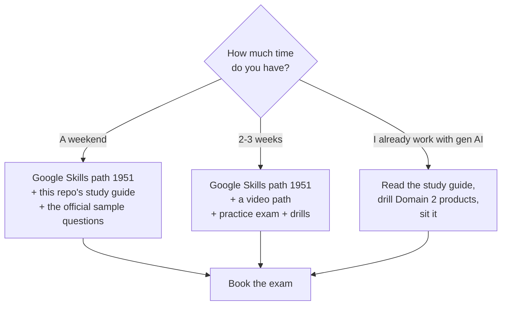

# Courses — what I watched, and what each one is worth

The point of this folder is to save you hours. Each course is listed with its **exact title** (so you can find it), its length, which exam domain it serves, and a summary of what it actually teaches — so you can decide whether to watch it, skim it, or skip it.

---

## Which course should you take?

| Course / path | Cost | Hours | Verdict |
|---|---|---|---|
| **[Google Skills — Generative AI Leader Certification (path 1951)](01-genai-leader-path.md#the-official-google-path)** | Free | ~5 activities | **Start here.** Google's own material, in the current product vocabulary |
| **[Pluralsight — Google Cloud Generative AI Leader path](01-genai-leader-path.md#the-pluralsight-path)** | Subscription | ~6h | Good structure — the four courses map 1:1 onto the four exam domains. Uses the **old product names** |
| **[Pluralsight — Generative AI: Engineering and Architecture](02-engineering-architecture-path.md)** | Subscription | ~15h | **Not needed for this exam.** Excellent engineering material, wrong altitude. Save it for after you pass |

> **The trap in course selection:** course length does not track exam weight. Domain 2 (Google Cloud's offerings) is ~35% of the exam, and the Pluralsight path gives it only 1h25m. **Whatever course you pick, you will need to top up Domain 2 separately** — that is what [the product table](../study-guide/03-product-table.md) and [the Domain 2 drill](../practice/02-domain-2-product-drill.md) are for.

---

## Files

- **[01-genai-leader-path.md](01-genai-leader-path.md)** — the exam-aligned courses, summarised course by course and module by module.
- **[02-engineering-architecture-path.md](02-engineering-architecture-path.md)** — the deeper engineering path: what is in it, and why it is not exam material.
