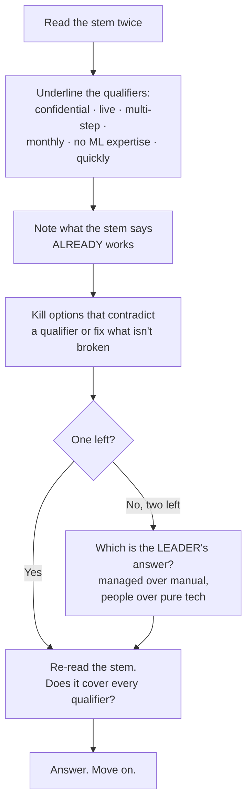

# Exam technique

On this exam, technique is worth roughly as much as content. The questions are scenario-shaped, the distractors are patterned, and the patterns repeat.

---

## The core method: eliminate three, then justify one

Do not read the four options looking for the right one. **Read them looking for reasons to kill three.** Then check that the survivor answers every qualifier in the stem.

---

## The six distractor patterns

| Pattern | What it looks like | Example |
|---|---|---|
| **1. Reality flip** | States the opposite of the truth, confidently | *"Fine-tuning provides better source attribution than RAG"* — backwards |
| **2. Use-case swap** | A real technique attached to the wrong job | *"RAG is better for teaching a specific brand tone"* — that is fine-tuning |
| **3. Too narrow** | True, but does not answer the whole question | Names a capability that covers half the stated requirement |
| **4. Invented policy** | A plausible-sounding rule that does not exist | *"Google's Locked Ecosystem policy"* — no such thing |
| **5. Manual / brute force** | Technically possible but inefficient | *"Manually port open-source code to run on proprietary hardware"* |
| **6. Right layer, wrong moment** | A real product at the wrong stage | *Conversational Insights* (after the call) when the stem says **during** the call → *Agent Assist* |

---

## Three tells in the stem

1. **Keyword clustering.** If a word like *"manual"* appears in three options and not the fourth, that is usually the shape of the answer.
2. **Constraint words.** *"Quickly", "limited expertise", "strict budget", "changes monthly", "real-time", "during a live call", "confidential"* — each one eliminates half the options by itself.
3. **What the stem says already works.** *"They have already selected a foundation model and built the agent logic"* means the model layer and the agent layer are **not** the answer. The exam frequently tells you where the problem is not.

---

## Two rules that decide close calls

**Rule 1 — the efficient answer wins.** If option X would work in six steps and option Y is the managed service built for exactly this, the answer is Y. Google Cloud exams reward the managed path. "Build it from scratch", "train a proprietary model on all available enterprise data" and "manually port" are almost never correct.

**Rule 2 — it is a leadership exam.** Google's own description says the certified person's expertise is *"in strategic leadership and influence, not technical implementation."* When a technical answer and a people/process answer are both defensible, **the people answer usually wins.** Adoption, training, change management and governance are first-class answers here, not soft extras.

> The course material says it outright: *"technology is only one part of the equation. People and processes ultimately determine success."*

---

## 🔴 Multi-select: where most marks leak

I lost marks on **all three** multi-select questions I faced. Every one was an under-selection. Four rules, applied mechanically:

1. **Read the stem for the count.** "Which component**s**", "the primary advantage**s**", "the most critical consideration**s**" — **plural nouns mean multiple answers.** The stem tells you every time.
2. **Judge each option independently:** *is this statement true, and does it answer the question?* Not *is this the best one?* Multi-select is not a competition between options; each stands alone.
3. **If the interface does not say how many to pick, assume two.** Never submit a single tick unless you have actively rejected the other three with a reason.
4. **Guard the other direction too.** A statement can be plausible and still false. Adding a wrong answer costs as much as omitting a right one.

---

## Timing

90 minutes for 50–60 questions is **about 95 seconds each** — comfortable. Most questions take 40 seconds; a few scenario questions take three minutes.

- Answer, flag, move. **Never leave one blank** — there is no penalty for guessing.
- If you are still reading a question at 90 seconds, flag it and go. Your first instinct on a product-recall question is usually right; your fifth re-read usually is not.
- Aim to reach the end with 15 minutes left for flagged questions.

---

## Five facts that decide a surprising number of questions

1. **Changing facts → RAG. Changing behaviour or tone → fine-tuning.** Confidential and must be citable → RAG (for **traceability**, not cost).
2. **Agent Assist = live, during the call. Conversational Insights = afterwards.**
3. **Function calling: the model *requests* (structured JSON); your code *executes*.**
4. **Grounding controls information, not tone.**
5. **Anything naming artificial general intelligence as the solution to a business problem is wrong.** AGI does not exist.

Full treatment: [the main study guide, Section 1](../study-guide/01-full-study-guide.md), and [common mistakes](../practice/03-common-mistakes.md).
